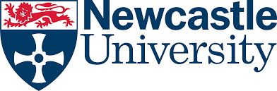

# **SSP**
Software Stack Program (SSP). The process to automate the assessment of Machine Learning (ML) Models.

**NOTE: This work was for dissertation of Computer Science in the theme of Data Science and Machine Learning**

# Preview

## Data Processing Stack

## Data Manipulation and Training of ML Models

## Analytics For ML Models

# Installation

This notebook was solely designed and tested on [Google Colab](https://colab.research.google.com/)

# Usage

[Flowchart of the Software Stack Program](assets/images/flowchart-ssp.png)
...

# Author and Acknowledgment

Author: [Abdullah Alshadadi](https://github.com/Srking501)

Special Thanks to: [The Centre for Search Research (TCSR)](https://tcsr.org.uk/)

# License

...
